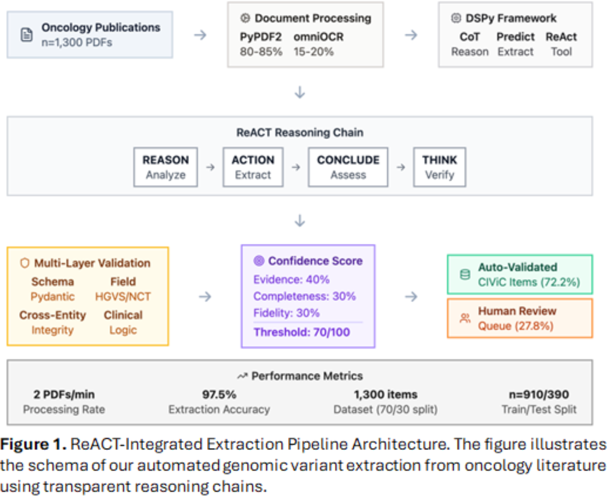
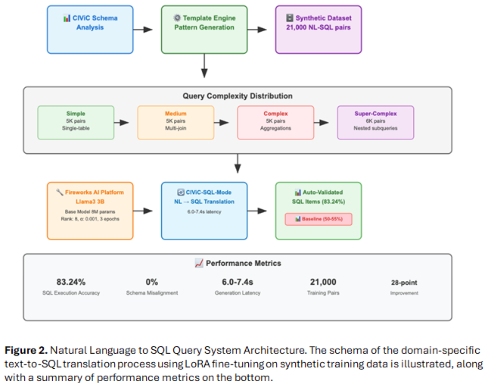
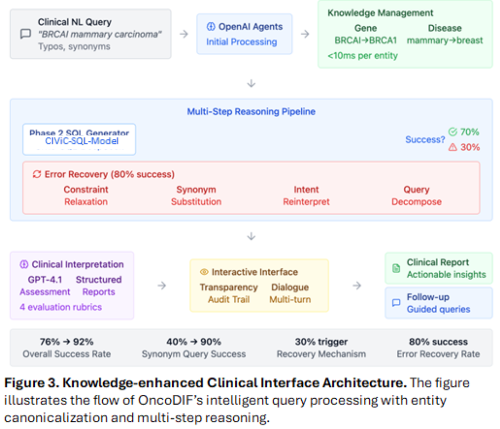
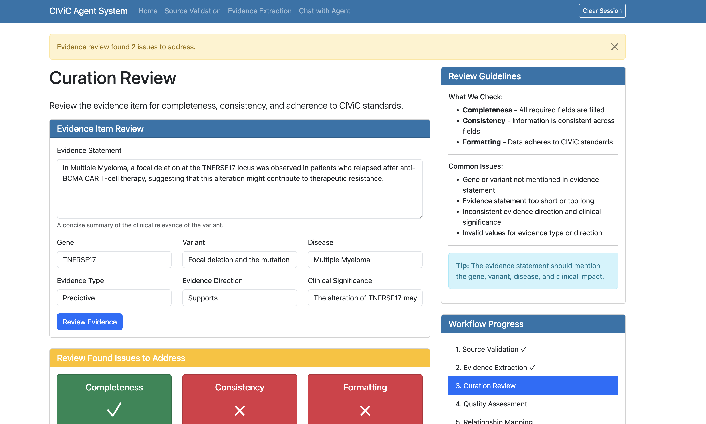
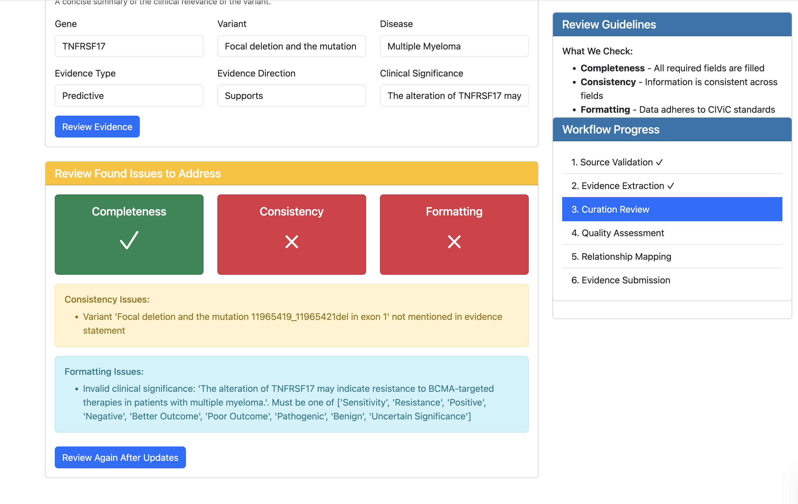
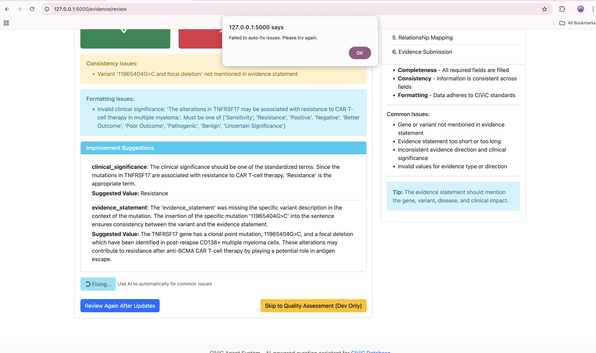
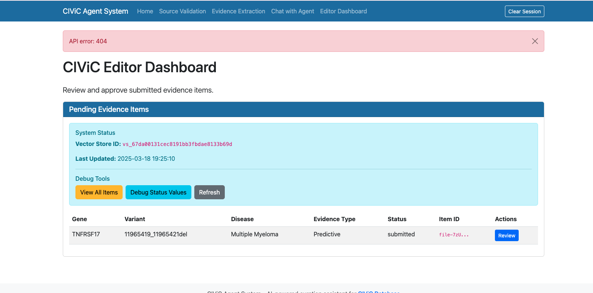

# 🧬 OncoDIF: Oncology Dynamic Integrated Framework

**An Auditable AI Framework for Automated Genomic Curation and Natural-Language Clinical Querying in Precision Oncology**


[](https://opensource.org/licenses/MIT)
[](https://github.com/Ali-Maq/oncodif_public)

---

## 📊 **Performance Metrics**

Our three-phase AI framework achieves the following performance metrics:

| **Phase**   | **Metric**        | **Performance**     | **Baseline Comparison**      |
| ----------------- | ----------------------- | ------------------------- | ---------------------------------- |
| **Phase 1** | Extraction Accuracy     | **97.5%**           | -                                  |
| **Phase 1** | Processing Speed        | **2 PDFs/minute**   | Manual curation: 30 min/variant    |
| **Phase 2** | SQL Generation Accuracy | **83.24%**          | Baseline models: 50-55%            |
| **Phase 2** | Generation Latency      | **6.0-7.4 seconds** | Consistent across complexity tiers |
| **Phase 3** | Clinical Query Success  | **92%**             | **76% → 92% improvement**   |
| **Phase 3** | Synonym Query Handling  | **90%**             | **40% → 90% improvement**   |

---

## 🎯 **Overview**

OncoDIF bridges the gap between complex genomic databases and clinical practice through a three-phase AI framework that transforms manual, time-intensive genomic curation into an automated, transparent, and clinically accessible system.

### **The Challenge**

* Medical geneticists spend **up to 30 minutes per variant analysis**
* Current genomic databases require specialized bioinformatics expertise
* **Low confidence in genomic interpretation** among oncologists
* **Fragmented evidence** across multiple databases with heterogeneous schemas

### **Our Solution**

A comprehensive AI framework that provides:

* ✅ **Automated evidence extraction** with transparent reasoning
* ✅ **Natural language database querying** without SQL knowledge
* ✅ **Clinical interpretation** with guideline-aligned recommendations
* ✅ **Complete audit trails** for regulatory compliance

---

## 🏗️ **Three-Phase Architecture**

### **Phase 1: ReACT-Enhanced Automated Extraction**

```
📄 Literature Input → 🧠 ReACT Reasoning → 📊 CIViC-Compatible Output
```



* **Technology** : Reason-Action-Conclude-Think (ReACT) paradigm with DSPy framework
* **Model** : GPT-4.1 fine-tuned on 1,300 CIViC-validated publications
* **Output** : Structured evidence items with complete reasoning traces
* **Performance** : 97.5% extraction accuracy at 2 PDFs/minute

### **Phase 2: Natural Language-to-SQL Translation**

```
🗣️ Clinical Query → 🔄 LoRA Fine-tuned Model → 💾 Executable SQL
```


* **Technology** : LoRA-tuned Llama-3.2 3B model on Fireworks AI platform
* **Training Data** : 21,000 synthetic question-SQL pairs across 4 complexity tiers
* **Validation** : Automated SQL execution verification on CIViC database
* **Performance** : 83.24% SQL generation accuracy with 6.0-7.4s latency

### **Phase 3: Knowledge-Enhanced Clinical Interface**

```
❓ Clinical Question → 🧠 Multi-Step Reasoning → 🏥 Clinical Recommendation
```

* **Technology** : GPT-4.1-driven query clarification and result interpretation
* **Features** : Entity canonicalization, synonym resolution, clinical context integration
* **Interface** : Streamlit web application for intuitive clinical workflows
* **Performance** : 92% query success rate with 90% synonym handling accuracy

---

## 📁 **Repository Structure**

```
oncodif_public/
├── 📂 phase1_react_dspy_extraction/
│   ├── 📄 dspy_fine_tuning_civic_data.py      # DSPy fine-tuning on CIViC data
│   ├── 📄 react_extraction_pipeline.py        # Main ReACT extraction pipeline
│   ├── 📄 civic_training_data_loader.py       # CIViC training data integration
│   └── 📄 README.md                           # Phase 1 methodology
│
├── 📂 phase2_nlp_to_sql_translation/
│   ├── 📄 gpt4_synthetic_query_generator.py   # GPT-4.1 query generation
│   ├── 📄 sql_validation_loop_civic.py        # SQL execution validation
│   ├── 📄 fireworks_lora_llama_training.py    # Fireworks AI LoRA training
│   ├── 📄 llama_inference_pipeline.py         # Fine-tuned model inference
│   ├── 📄 synthetic_dataset_generator.py      # 21K training pairs generation
│   └── 📄 README.md                           # Phase 2 methodology
│
├── 📂 phase3_clinical_reasoning_interface/
│   ├── 📄 gpt4_query_clarification_system.py  # Clinical query clarification
│   ├── 📄 sql_result_explanation_engine.py    # Result interpretation
│   ├── 📄 clinical_reasoning_pipeline.py      # Multi-step reasoning engine
│   ├── 📄 streamlit_clinical_interface.py     # Web interface
│   └── 📄 README.md                           # Phase 3 methodology
│
├── 📂 data_samples/
│   ├── 📄 gprc5d_case_study_sample.json       # GPRC5D resistance mechanisms
│   ├── 📄 sample_civic_evidence_items.json    # CIViC evidence examples
│   ├── 📄 sample_synthetic_nl_sql_pairs.json  # Training data examples
│   └── 📄 sample_clinical_queries.json        # Clinical query examples
│
├── 📂 configs/
│   ├── 📄 civic_api_config.json               # CIViC API configuration
│   ├── 📄 model_hyperparameters.json          # Model parameters
│   └── 📄 system_prompts.json                 # GPT-4.1 system prompts
│
└── 📂 utils/
    ├── 📄 civic_api_client.py                 # CIViC database utilities
    ├── 📄 data_validation_helpers.py          # Data validation functions
    └── 📄 performance_evaluation_metrics.py   # Evaluation metrics
```

---

## 🔬 **GPRC5D Case Study: Resistance Mechanisms in Multiple Myeloma**

Our framework successfully extracted **15 CIViC-compliant evidence items** from recent literature on GPRC5D-targeted therapy resistance, demonstrating the system's ability to capture emerging therapeutic evidence.

### **Extracted Evidence Categories:**

#### **Genetic Mechanisms** (9 evidence items)

* **Point mutations** : Arg233Ter, Tyr257Ser, Glu146Ter
* **Frameshift mutations** : E27fs, S125fs, F158fs, Leu174TrpfsTer180
* **In-frame deletions** : G97_F100del
* **Clonal fractions** : 6.2% to 45%

#### **Epigenetic Mechanisms** (1 evidence item)

* **Promoter hypermethylation** : >99.8% cells lacking GPRC5D expression
* **Mechanism** : Long-range promoter/enhancer chromatin closure

#### **Structural Mechanisms** (4 evidence items)

* **Focal deletions** : 220 kb, 267 kb biallelic deletions
* **Chromosomal alterations** : Chromosome 12p arm deletions
* **Convergent evolution** : Complete target antigen loss

### **Clinical Impact**

Each evidence item includes:

* ✅ **Patient identifiers** and clinical timelines
* ✅ **Quantitative clonal fractions** for resistance tracking
* ✅ **Mechanistic details** for therapeutic decision-making
* ✅ **CIViC compatibility** for database integration

---

## 🖥️ **Clinical Interface**







### **Interface Features:**

* **Natural Language Input** : "What are treatment options for EGFR L858R in lung cancer?"
* **Automated Reasoning** : Multi-step query clarification and entity resolution
* **Clinical Context** : Patient stage, histology, prior therapies integration
* **Guideline Alignment** : AMP/ASCO/CAP standard compliance
* **Transparent Results** : Complete reasoning traces and confidence scores

---

## 🚀 **Quick Start**

### **Prerequisites**

* Python 3.8+
* OpenAI API key (for GPT-4.1)
* Fireworks AI API key (for LoRA training)

### **Installation**

```bash
# Clone the repository
git clone https://github.com/Ali-Maq/oncodif_public.git
cd oncodif_public

# Install dependencies
pip install -r requirements.txt

# Set up environment variables
export OPENAI_API_KEY="your-openai-api-key"
export FIREWORKS_API_KEY="your-fireworks-api-key"
```

### **Usage Examples**

#### **Phase 1: Extract Evidence from Literature**

```python
from phase1_react_dspy_extraction.react_extraction_pipeline import ReactExtractionPipeline

# Initialize extraction pipeline
extractor = ReactExtractionPipeline()

# Extract evidence from PDF
evidence_items = extractor.extract_from_pdf("research_paper.pdf")

# Output: CIViC-compatible evidence items with reasoning traces
```

#### **Phase 2: Generate SQL from Natural Language**

```python
from phase2_nlp_to_sql_translation.llama_inference_pipeline import LlamaInferencePipeline

# Initialize fine-tuned model
translator = LlamaInferencePipeline()

# Translate natural language to SQL
query = "Show me all EGFR mutations with sensitivity to erlotinib"
sql_result = translator.translate_query(query)

# Output: Executable SQL with complexity classification
```

#### **Phase 3: Clinical Query Processing**

```python
from phase3_clinical_reasoning_interface.clinical_reasoning_pipeline import ClinicalReasoningPipeline

# Initialize clinical interface
clinical_system = ClinicalReasoningPipeline()

# Process clinical query
clinical_query = "Patient with EGFR L858R, stage IV lung adenocarcinoma, treatment options?"
recommendation = clinical_system.process_clinical_query(clinical_query)

# Output: Clinical recommendations with evidence levels and reasoning
```


---

## 🎓 **Research Methodology**

### **Phase 1: ReACT-Enhanced Extraction**

* **Framework** : DSPy with ReACT paradigm for transparent reasoning
* **Training Data** : 1,300 human-validated CIViC publications (70/30 train/test split)
* **Validation** : Multi-layer validation (schema, field patterns, cross-entity integrity, clinical logic)
* **Innovation** : First application of reasoning-action frameworks to biomedical extraction

### **Phase 2: Domain-Specific Fine-Tuning**

* **Base Model** : Llama-3.2 3B parameter model
* **Fine-Tuning** : LoRA (Low-Rank Adaptation) on Fireworks AI platform
* **Dataset** : 21,000 synthetic question-SQL pairs across 4 complexity tiers
* **Validation** : Automated SQL execution verification on CIViC database

### **Phase 3: Knowledge Integration**

* **Query Clarification** : GPT-4.1 with domain-specific system prompts
* **Entity Canonicalization** : Gene aliases, variant notations, disease terms
* **Multi-Step Reasoning** : Constraint relaxation, synonym substitution, intent reinterpretation
* **Clinical Interpretation** : AMP/ASCO/CAP guideline alignment

---

## 📈 **Key Innovations**

1. **Transparent AI Reasoning** : Complete audit trails for regulatory compliance
2. **Domain-Specific Fine-Tuning** : Purpose-built NLP-to-SQL for genomic databases
3. **Clinical Context Integration** : Patient-specific factors in recommendation engine
4. **Real-Time Processing** : Minutes instead of weeks for variant interpretation
5. **Modular Architecture** : Model-agnostic framework supporting different LLMs

---

## 🗃️ **Datasets**

### **CIViC Training Data**

* **Source** : [CIViC Database](https://civicdb.org/) - Clinical Interpretation of Variants in Cancer
* **Size** : 1,300 expert-curated publications
* **Format** : Human-validated evidence items with clinical annotations
* **Usage** : DSPy fine-tuning for Phase 1 extraction

### **Synthetic NL-SQL Pairs**

* **Generation** : GPT-4.1 with CIViC schema knowledge
* **Size** : 21,000 question-SQL pairs
* **Complexity Tiers** : Simple, Medium, Complex, Super-Complex
* **Validation** : Automated SQL execution verification

### **Clinical Query Examples**

* **Source** : Simulated clinical scenarios
* **Categories** : Treatment options, resistance mechanisms, prognostic factors
* **Context** : Patient stage, histology, biomarkers, prior therapies

---

## 🤝 **Contributing**

We welcome contributions to advance precision oncology research:

1. **Fork** the repository
2. **Create** a feature branch (`git checkout -b feature/enhancement`)
3. **Commit** your changes (`git commit -am 'Add new feature'`)
4. **Push** to the branch (`git push origin feature/enhancement`)
5. **Create** a Pull Request

### **Research Areas for Contribution**

* **Multi-modal extraction** : Integration of figures and tables
* **Cross-database federation** : OncoKB, COSMIC, ClinVar integration
* **Real-time literature monitoring** : Automated evidence updates
* **Clinical decision trees** : Structured treatment pathways
* **Outcome prediction** : Survival analysis and prognosis modeling

---

## 📄 **License**

This project is licensed under the MIT License - see the [LICENSE](https://claude.ai/chat/LICENSE) file for details.

### **Clinical Disclaimer**

⚠️  **Important** : OncoDIF is a research tool intended for investigational purposes only. It is not intended for use in clinical diagnosis, treatment, or patient care decisions. All results should be validated by qualified healthcare professionals before any clinical application.

---

## 📚 **Citation**

If you use OncoDIF in your research, please cite our paper:

```bibtex
@article{quidwai2024oncodif,
  title={OncoDIF: An Auditable AI Framework for Automated Genomic Curation and Natural-Language Clinical Querying in Precision Oncology},
  author={Quidwai, Mujahid and Thibaud, Santiago and Jagannath, Sundar and Parekh, Samir and Lagan{\`a}, Alessandro},
  journal={[Journal Name]},
  year={2024},
  doi={10.xxxx/xxxx}
}
```

---

## 👥 **Authors**

* **Mujahid Quidwai** - Department of Oncological Sciences, Icahn School of Medicine at Mount Sinai
* **Santiago Thibaud** - Division of Hematology and Medical Oncology, Icahn School of Medicine at Mount Sinai
* **Sundar Jagannath** - Division of Hematology and Medical Oncology, Icahn School of Medicine at Mount Sinai
* **Samir Parekh** - Division of Hematology and Medical Oncology, Tisch Cancer Institute, Icahn School of Medicine at Mount Sinai
* **Alessandro Laganà** - Department of Oncological Sciences, Tisch Cancer Institute, Department of Genetics and Genomic Sciences, Icahn School of Medicine at Mount Sinai

## 📧 **Contact**

**Author** : Mujahid Quidwai

📧 Email: mujahid.quidwai@mssm.edu

🏥 Institution: Icahn School of Medicine at Mount Sinai

📍 Address: 1470 Madison Avenue, New York, NY 10029

---

## 🙏 **Acknowledgments**

* **CIViC Database Team** for providing open-access genomic variant interpretations
* **Fireworks AI** for providing the platform for efficient LoRA fine-tuning
* **OpenAI** for GPT-4.1 API access enabling transparent reasoning
* **Mount Sinai Health System** for computational resources and clinical expertise
* **Precision Oncology Community** for valuable feedback and validation
